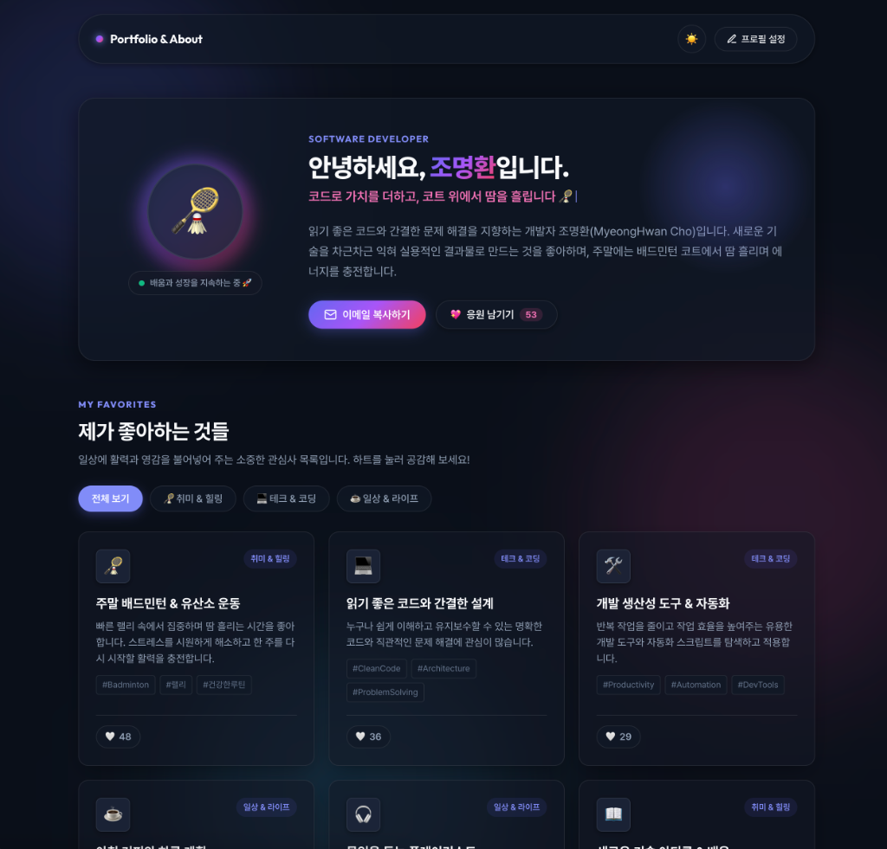

# ✨ Modern Interactive Self-Introduction Webpage

소프트웨어 개발자 **조명환(MyeongHwan Cho)**의 모던하고 인터랙티브한 개인 자기소개 및 포트폴리오 웹페이지입니다.  
HTML, CSS, JavaScript 순수 웹 기술(Vanilla)만을 사용하여 가볍고 빠르며, 글래스모피즘(Glassmorphism)과 앰비언트 글로우(Ambient Glow) 효과를 적용하여 세련된 시각 경험을 제공합니다.

---

## 📸 실행 화면 미리보기 (Preview)

| 🌙 다크 모드 (Dark Mode) | ☀️ 라이트 모드 (Light Mode) |
| :---: | :---: |
|  |  |

---

## 🌟 주요 특징 (Key Features)

- **🎨 모던 비주얼 & 애니메이션**
  - 오로라 그라데이션 및 부드러운 앰비언트 블러 효과
  - 헤더 타이핑 애니메이션 (Typewriter Effect - 이모지 분할 완벽 지원)
  - 감각적인 마이크로 인터랙션 (카드 호버, 하트 파티클 이펙트)
- **🌓 다크 / 라이트 모드 전환**
  - 시스템 선호도 및 사용자 선택 저장 (`localStorage`)
  - 테마별 최적화된 대비와 컬러 팔레트 제공
- **🎯 인터랙티브 관심사 & 좋아하는 것 쇼케이스**
  - 테크, 일상, 취미(배드민턴) 등 카테고리별 실시간 탭 필터링
  - 항목별 공감 하트(좋아요) 카운팅 및 로컬 저장
- **⚙️ 프로필 간편 수정 (In-Browser Customizer)**
  - 코드 수정 없이도 브라우저 상에서 이름, 상태 메시지, 소개글을 즉시 변경하고 테스트 가능
- **💌 원클릭 이메일 복사**
  - 클립보드 복사 기능 및 피드백 토스트(Toast) 팝업 알림
- **📱 완전한 반응형 디자인**
  - 모바일, 태블릿, 데스크톱 모든 디바이스에 최적화된 레이아웃

---

## 📂 프로젝트 구조 (Project Structure)

```text
about-myeonghwan/
├── assets/          # 미리보기 스크린샷 이미지
│   ├── preview-dark.png
│   └── preview-light.png
├── index.html       # 시맨틱 마크업, 메타 태그, 모달 및 토스트 UI 구조
├── style.css        # CSS 변수 토큰, 글래스모피즘, 반응형 미디어 쿼리
├── script.js        # 상태 관리, 테마 토글, 필터링, 파티클 및 리액션 로직
├── README.md        # 프로젝트 소개 및 가이드 문서
└── .gitignore       # Git 제외 대상 설정
```

---

## 🚀 시작하기 (Getting Started)

별도의 빌드나 의존성 설치 과정 없이 웹 브라우저에서 바로 실행할 수 있습니다.

### 방법 1. 직접 열기
`index.html` 파일을 더블 클릭하거나 웹 브라우저 창으로 드래그하여 바로 열 수 있습니다.

### 방법 2. 로컬 웹 서버 실행 (권장)
Python이 설치되어 있는 경우:
```bash
# 로컬 서버 실행 (포트 8080)
python3 -m http.server 8080
```
실행 후 브라우저에서 `http://localhost:8080`에 접속합니다.

---

## 🛠️ 기술 스택 (Tech Stack)

- **Markup**: HTML5 (Semantic Elements, Accessibility)
- **Styling**: Vanilla CSS3 (Custom Properties, Flexbox, Grid, Keyframes, Backdrop-filter)
- **Logic**: Vanilla JavaScript (ES6+, LocalStorage API, Clipboard API)
- **Typography**: Pretendard, Google Fonts (Outfit)

---

## 📄 라이선스 (License)

This project is open-source and available under the [MIT License](LICENSE).
